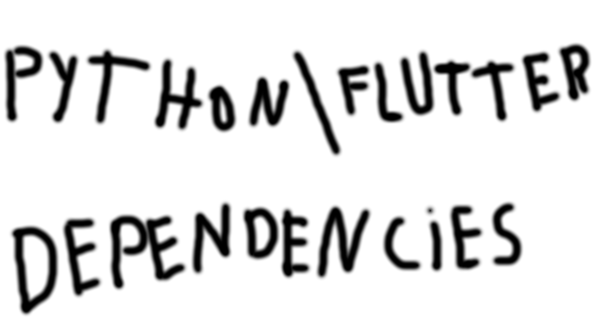

# YTD-Simplest-Youtube-Video-Downloader-Ever(For-DEVs)
Back-end = Python File(Flask API and pytube logic), Front-end = Basic Flutter Interface

## Start your Virtual Enviroment

### Python:
Install Python

Install pytube -> on terminal -> pip install pytube

Install flask -> on terminal -> pip install flask

Install flask-restful -> on terminal -> pip install flask-restful

### Flutter:

Install Flutter SDK -> https://docs.flutter.dev

Create new Flutter Project -> on terminal -> flutter create "Project Name"

Navigate to your project folder and open the terminal

Install http package -> on terminal -> flutter pub add http

## After dependencies section:

Download the 2 files and place flutter main.dart file on your flutter project lib folder / I recommend placing the python app.py on the same folder for convenience

## Usage:

Open the terminal and navigate to the flutter project lib folder

First iniciate the server -> on terminal -> python app.py

Run the flutter main.dart file with you chosen IDE run button

Paste the youtube link on the textfield and press the download button

Your video should download on the same directory in the higher resolution

